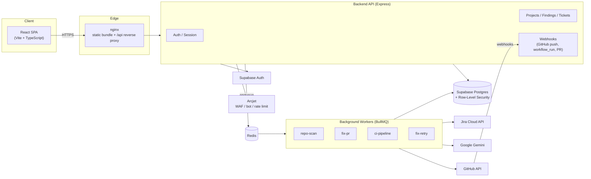

<p align="center">
  
</p>

<h3 align="center">Vulnerability Remediation Platform</h3>

<p align="center">
  Ingest. Triage. Ticket. Fix. Verify. — an end-to-end pipeline that turns raw vulnerability<br/>
  scan output into merged, CI-verified pull requests.
</p>

<p align="center">
  
  
  
  
  
  
  
</p>

---

## Table of Contents

- [Overview](#overview)
- [Core Capabilities](#core-capabilities)
- [Architecture](#architecture)
- [Technology Stack](#technology-stack)
- [Repository Structure](#repository-structure)
- [Getting Started](#getting-started)
- [Environment Variables](#environment-variables)
- [Data Model](#data-model)
- [API Surface](#api-surface)
- [Security Architecture](#security-architecture)
- [CI/CD](#cicd)
- [Deployment](#deployment)
- [Project Status](#project-status)
- [License](#license)

---

## Overview

**Bankai** is a security remediation platform that closes the loop between vulnerability
discovery and verified fixes. Most organizations already have scanners producing findings
(SAST, SCA, container, DAST) — the gap Bankai targets is everything *after* that: turning
a spreadsheet of CVEs into deduplicated, SLA-tracked tickets, generating an AI-authored
code fix, opening a pull request against the affected repository, and automatically
verifying that fix through a CI pipeline before it ever reaches a human reviewer.

The platform is organized around **projects** (one per repository/application under
management), each with its own connected GitHub repository, optional Jira project, SLA
policy, and role-based team membership.

```
Scan / Report  →  Findings  →  Triage  →  Tickets  →  Jira sync  →  AI Fix PR  →  CI Verification
```

---

## Core Capabilities

### 1. Vulnerability Intake
- **CSV ingestion** from arbitrary scanner exports — column-name aliasing normalizes
  differing vendor schemas (severity, CVSS, CWE, component, CVEs, affected/fixed
  versions, etc.) into one canonical finding shape.
- **AI-driven repository scanning** — given a connected GitHub repo, Bankai walks the
  tree (bounded by configurable file-count/size caps), sends relevant source to Gemini,
  and produces findings with `remediation_guidance` and precise `line_start`/`line_end`
  locations attached.
- **Jira import** — existing Jira issues can be pulled in as findings, keeping legacy
  backlogs inside the same triage and remediation flow.
- **Push-triggered rescans** — an auto-registered GitHub webhook re-scans a repo on every
  push to the default branch, diffing against the prior commit.

### 2. Triage & Deduplication
Every finding is fingerprinted so repeat scans classify into **New Delta / In Progress /
Changed / Resolved** buckets instead of re-flagging the same issue every run. Each project
defines its own SLA policy (days-to-remediate per severity — Critical/High/Medium/Low),
and every finding/ticket carries a computed **Missed / Approaching / On track** status.

### 3. Ticketing & Jira Sync
Findings are promoted into tickets with a project-scoped, sequential key
(`<prefix>-<n>`). Tickets can be pushed to a connected Jira project as real issues and
kept in sync bidirectionally — status transitions (`To Do → In Progress → In Review →
Done`) mirror pipeline progress, and Bankai posts fix/CI evidence back as Jira comments.

### 4. AI-Assisted Automated Remediation
For a ticket with a connected GitHub repo, Bankai:
1. Creates a dedicated remediation branch and gathers targeted repo context (surrounding
   source, related tests, directory tree) bounded by configurable budgets.
2. Calls **Gemini** to generate a concrete code fix for the finding.
3. Commits the fix to the branch and opens a **pull request**, transitioning the linked
   Jira issue and recording the action in the project activity feed.
4. On CI failure, automatically **parses build/test logs**, generates a corrected fix, and
   retries — up to a bounded number of attempts — before handing off to a human.

### 5. CI/CD Verification Pipeline
Bankai does not trust its own fixes blindly. If a target repository has no
`.github/workflows/bankai-verify.yml`, Bankai opens a one-time **bootstrap PR** to add
one, with `build` / `functional-test` / `integration-test` commands **auto-detected** from
the repo's stack (Node, Python, Java, Go, Rust, C#, Ruby, PHP, C++) wherever inferable,
and `image` / `deploy-dev` left as clearly marked placeholders for infra that can't be
guessed. Once merged, every remediation PR's branch is dispatched through this workflow,
and the resulting `workflow_run` webhook (job-by-job: Build → Image → Deploy Dev →
Functional Test → Integration Test) drives the ticket's live CI status in the UI.

### 6. Collaboration & Access Control
Projects support multi-user membership with four roles — **Owner, Admin, Editor,
Viewer** — enforced by both Postgres row-level security and an explicit
`requireRole` check in every controller (so a blocked write surfaces as a loud 403, not a
silent no-op). Teammates are added via email invite with accept/decline flows.

### 7. Activity & Audit Trail
Every meaningful state change — scan completed, finding triaged, ticket created, PR
opened, CI passed/failed, member added — is recorded as a structured, project-scoped
activity event for full auditability.

---

## Architecture



- **Frontend** — a single-page app (workspace shell + sidebar routing) for auth, project
  management, and the full remediation workflow: Overview, Report Intake, AI Triage,
  Tickets, Activity, and Settings.
- **Backend API** — stateless Express process; every state-changing route is
  project-scoped, role-checked, and Arcjet-protected.
- **Worker** — a separate Node process (required for horizontal scaling and crash
  isolation from the API) consuming four BullMQ queues backed by Redis: repository
  scanning, AI fix generation + PR creation, CI pipeline dispatch, and fix-retry-on-failure.
- **Supabase** — Postgres (with RLS as the primary authorization boundary) and Auth
  (email/password + Google/GitHub OAuth).
- **External integrations** — GitHub (repo scanning, branch/commit/PR, webhooks),
  Jira Cloud (issue sync, comments, transitions), Google Gemini (finding generation and
  fix generation), Arcjet (WAF, bot detection, rate limiting).

---

## Technology Stack

| Layer | Technology |
| --- | --- |
| Frontend | React 19, TypeScript, Vite, React Router 7, Oxlint |
| Backend API | Node.js 22, Express 5, TypeScript, Zod |
| Background jobs | BullMQ (Redis-backed) |
| Database & Auth | Supabase (Postgres + Row-Level Security, Supabase Auth) |
| AI | Google Gemini (`@google/genai`) |
| Security | Arcjet (WAF, bot detection, rate limiting, email validation), helmet, httpOnly cookie sessions |
| Integrations | GitHub REST API, Jira Cloud REST API |
| Observability | Pino (structured logging), pino-http |
| Testing | Vitest |
| Containerization | Docker, multi-stage builds, nginx (frontend/edge), Docker Compose |
| CI | GitHub Actions |

---

## Repository Structure

```
.
├── frontend/                    React + Vite + TypeScript SPA
│   └── src/
│       ├── pages/                Auth pages, Projects, workspace shell
│       │   └── workspace-pages/  Overview, Report Intake, AI Triage, Tickets, Activity, Settings
│       ├── components/           Sidebar, RepoPicker, InviteBell, CI status indicators
│       └── lib/                  API client, auth context, project context, roles
│
├── backend/                     Express + TypeScript API and worker
│   └── src/
│       ├── controllers/          Request handlers (auth, projects, findings, tickets, github, jira, sso, webhooks, ...)
│       ├── routes/               Route definitions, project-scoped nesting
│       ├── middleware/           requireAuth, loadProject, origin-check, Arcjet baseline
│       ├── schemas/               Zod request validation
│       ├── jobs/                  BullMQ processors (repo-scan, fix-pr, fix-retry, ci-pipeline)
│       ├── lib/                   GitHub/Jira/Gemini clients, crypto, CI template generation,
│       │                          stack detection, log parsing, SLA logic, repo context assembly
│       ├── server.ts              API entrypoint
│       └── worker.ts              Background worker entrypoint
│
├── supabase/
│   └── migrations/               Ordered SQL migrations (schema + RLS policies)
│
├── deploy/
│   ├── Dockerfile                 Multi-stage build → static bundle served by nginx
│   └── nginx.conf                 SPA routing + reverse proxy of /api to the backend
│
├── docker-compose.yml             Local, production-like run (frontend :8080, backend behind it)
├── .github/workflows/deploy.yml   CI: frontend build, backend typecheck + build
└── .env.example                   Frontend env template
```

---

## Getting Started

### Prerequisites

- Node.js **≥ 22.21**
- A [Supabase](https://supabase.com) project
- A [Redis](https://redis.io) instance (local Docker/native install is fine for dev)
- An [Arcjet](https://app.arcjet.com) site key
- A [Google Gemini](https://aistudio.google.com/apikey) API key
- A GitHub OAuth App (for "Connect your GitHub account")

### Backend

```bash
cd backend
npm install
cp .env.example .env      # fill in Supabase, Arcjet, Gemini, GitHub OAuth, Redis
npm run dev                # API on http://localhost:4000
```

Run the background worker in a separate terminal (required for scans, AI fixes, and CI
dispatch to actually process):

```bash
cd backend
npm run worker
```

### Frontend

```bash
cd frontend
npm install
npm run dev                # http://localhost:5173
```

### Database

Apply the migrations in `supabase/migrations/` to your Supabase project (via the
Supabase CLI or dashboard SQL editor), in filename order.

### Tests & Checks

```bash
cd backend
npm run typecheck
npm run lint
npm test

cd ../frontend
npm run lint
npm run build
```

---

## Environment Variables

### Backend (`backend/.env`)

| Variable | Required | Description |
| --- | --- | --- |
| `NODE_ENV` | no | `development` \| `production` \| `test` |
| `PORT` | no | API port (default `4000`) |
| `SUPABASE_URL` | yes | Supabase project URL |
| `SUPABASE_ANON_KEY` | yes | Supabase anon/public key |
| `SUPABASE_SERVICE_ROLE_KEY` | yes | Service-role key — **backend only, never exposed to the frontend** |
| `ARCJET_KEY` | yes | Arcjet site key |
| `TOKEN_ENC_KEY` | yes | Base64 of 32 random bytes; encrypts Jira tokens, GitHub PATs/webhook secrets at rest |
| `FRONTEND_ORIGIN` | yes | Exact frontend origin — used for CORS, CSRF origin checks, and email redirect links |
| `COOKIE_DOMAIN` | no | Shared registrable domain for session cookies in production |
| `COOKIE_SAMESITE` | no | `lax` (default) \| `strict` \| `none` |
| `GEMINI_API_KEY` | yes | Google Gemini API key |
| `GEMINI_MODEL` | no | Defaults to `gemini-pro-latest` |
| `REDIS_URL` | no | Defaults to `redis://localhost:6379` |
| `BACKEND_PUBLIC_URL` | no | Publicly reachable backend URL, used to auto-register GitHub push webhooks |
| `MAX_SCAN_FILES` / `MAX_SCAN_FILE_BYTES` / `MAX_SCAN_TOTAL_BYTES` | no | Bound repo-scan volume/latency |
| `MAX_FIX_CONTEXT_FILES` / `MAX_FIX_CONTEXT_BYTES` / `MAX_FIX_TEST_FILES` / `MAX_FIX_TREE_DEPTH` | no | Bound AI fix-generation context assembly |
| `GITHUB_OAUTH_CLIENT_ID` / `GITHUB_OAUTH_CLIENT_SECRET` | yes | GitHub OAuth App for per-user "Connect your GitHub account" |

Full definitions and defaults live in [`backend/src/env.ts`](backend/src/env.ts) and are
validated (fail-fast) at process startup.

> "Log in with Google/GitHub" SSO uses Supabase's own OAuth provider configuration
> (dashboard-side) and needs no additional backend env vars — see
> [`backend/.env.example`](backend/.env.example) for the one-time setup steps.

### Frontend (`frontend/.env`)

| Variable | Description |
| --- | --- |
| `VITE_API_BASE_URL` | Backend base URL for local dev (e.g. `http://localhost:4000`). Left empty in production builds — nginx reverse-proxies `/api` to the backend. |

---

## Data Model

Schema evolves through ordered migrations in `supabase/migrations/`. Principal tables:

| Table | Purpose |
| --- | --- |
| `profiles` | User profile, including linked GitHub OAuth identity |
| `projects` | One per managed application/repo — SLA policy, GitHub/Jira connection state, CI bootstrap status, ticket key sequence |
| `project_services` | Services/components tracked under a project |
| `project_members` / `project_invites` | Role-based membership and pending email invites |
| `scans` | A single ingestion run (CSV upload or AI repo scan), with status, commit range, and trigger type |
| `findings` | Normalized vulnerability records — severity, CVSS, CWE, CVEs, affected/fixed versions, remediation guidance, source (csv / github_ai / jira_import) |
| `tickets` | Promoted, trackable units of work — Jira linkage, GitHub branch/PR tracking, CI status/run URL, fix-attempt counter |
| `pipeline_runs` | CI dispatch history per ticket |
| `activity_events` | Append-only, project-scoped audit log |

All tables enforce **row-level security** scoped to project ownership/membership;
role-gated mutations (insert/update/delete) are further restricted to Editor and above.

---

## API Surface

All routes are mounted under `/api`. Project-scoped routes require an authenticated
session and project membership; `loadProject` resolves and authorizes the project once
per request before any nested route runs.

| Base path | Covers |
| --- | --- |
| `/api/auth` | Sign up, login, logout, refresh, session, profile, password, account deletion |
| `/api/auth/github` | Per-user GitHub OAuth connect/disconnect/status/repo listing |
| `/api/auth/sso` | "Log in with Google/GitHub" via Supabase OAuth |
| `/api/projects` | Create/list/get/delete projects |
| `/api/projects/:id` | Update project settings |
| `/api/projects/:id/scans` | List scans, upload CSV, trigger/inspect scans |
| `/api/projects/:id/findings` | List/update findings |
| `/api/projects/:id/tickets` | List/create tickets, sync to Jira, retry CI pipeline |
| `/api/projects/:id/jira` | Connect/disconnect Jira |
| `/api/projects/:id/github` | Connect/disconnect repo, trigger AI scan |
| `/api/projects/:id/sla` | Update SLA policy |
| `/api/projects/:id/members` | Manage members and invites |
| `/api/projects/:id/overview` | Aggregate project stats |
| `/api/projects/:id/activity` | Project audit log |
| `/api/invites` | Accept/decline invites by token |
| `/api/webhooks/github/:projectId` | GitHub push / `workflow_run` / pull_request webhooks (HMAC-verified) |

---

## Security Architecture

- **Session model**: httpOnly, `SameSite` access/refresh cookies (`bankai_at` /
  `bankai_rt`) — never `localStorage` or a JSON response body — so sessions aren't
  reachable via XSS.
- **Arcjet**: Shield WAF, bot detection, and IP-based sliding-window rate limiting on
  authentication and other sensitive endpoints; disposable/invalid/undeliverable email
  rejection on signup.
- **CSRF defense-in-depth**: an explicit `Origin` header check on state-changing
  requests, layered on top of `SameSite` cookies.
- **Enumeration resistance**: signup returns an identical response regardless of whether
  the email is already registered.
- **Secrets at rest**: Jira API tokens, GitHub PATs, and GitHub webhook secrets are
  encrypted (`TOKEN_ENC_KEY`) before being persisted.
- **Webhook integrity**: GitHub webhook payloads are verified via HMAC signature against
  the raw request body (mounted ahead of the JSON body parser specifically to preserve
  those bytes).
- **Authorization defense-in-depth**: Postgres row-level security is the primary boundary;
  every controller additionally enforces role checks explicitly, so a disallowed write
  fails loudly (`403`) rather than silently affecting zero rows.
- **Server-side session revocation**: logout revokes the refresh token via the Supabase
  admin API (`signOut(token, "global")`), not just a client-side cookie clear.
- **Standard hardening**: `helmet` security headers, strict CORS bound to
  `FRONTEND_ORIGIN` with credentials, app-level password policy stricter than Supabase's
  default.

---

## CI/CD

Two distinct CI/CD surfaces exist in this repository:

1. **This repository's own pipeline** — [`.github/workflows/deploy.yml`](.github/workflows/deploy.yml)
   builds the frontend and type-checks + builds the backend on every push/PR to `main`.
2. **The verification pipeline Bankai manages for *customer* repositories** —
   `bankai-verify.yml`, which Bankai itself generates and bootstraps into a connected
   repo (`build → image → deploy-dev → functional-test → integration-test`), dispatches
   against every remediation branch, and uses as the source of truth for a ticket's CI
   status.

---

## Deployment

### Docker Compose (production-like, local)

```bash
SUPABASE_URL=... SUPABASE_ANON_KEY=... SUPABASE_SERVICE_ROLE_KEY=... ARCJET_KEY=... \
  docker compose up --build
# Frontend (and /api, reverse-proxied to the backend) at http://localhost:8080
```

`docker-compose.yml` runs two services: `backend` (built from `backend/Dockerfile`, a
multi-stage Node 22 Alpine build running as a non-root user) and `frontend` (built from
`deploy/Dockerfile`, a static bundle served by nginx per `deploy/nginx.conf`, which also
reverse-proxies `/api` to the backend and handles SPA routing).

### Manual build

```bash
cd frontend && npm install && npm run build   # → frontend/dist
cd ../backend && npm install && npm run build # → backend/dist
```

The background worker (`backend/src/worker.ts`) must be deployed as its own process
alongside the API server — it is not started automatically by `npm start`.

---

## Project Status

Actively developed. Implemented end-to-end: authentication (including SSO and
forgot/reset password), project and team management, CSV and AI-driven scan ingestion,
finding triage with SLA tracking, Jira ticket sync, AI-generated remediation PRs, and the
CI bootstrap/dispatch/retry-on-failure verification loop.

Known limitation: Arcjet's local fingerprint generator (`@arcjet/node@1.9.1`) currently
prevents rate-limiting `/login` by submitted email in addition to IP — see
[`backend/README.md`](backend/README.md#known-issue-arcjet-custom-characteristics) for
details and revisit criteria.

---

## License

Bankai is open source, licensed under the [MIT License](LICENSE).
